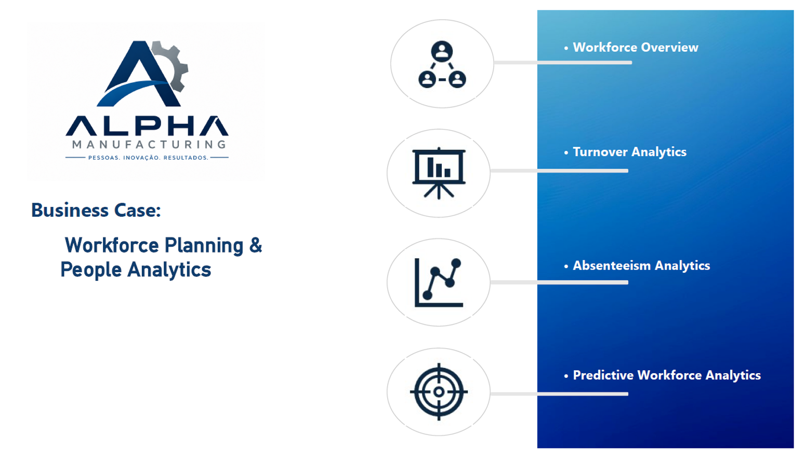

# Priscila Lima

### Senior Workforce Planning & People Analytics

**Transforming HR data into strategic business decisions**

---

Welcome to my professional portfolio.

With over 15 years of experience in Workforce Planning and People Analytics, I specialize in transforming HR data into strategic insights that support business decisions.

[About](#about) • [Skills](#skills) • [Projects](#featured-project) • [Resume](#resume) • [Contact](#contact)

---

## About

With over 15 years of experience in Workforce Planning and People Analytics, I have supported manufacturing operations by developing workforce planning strategies, HR analytics, executive dashboards, and KPI monitoring that enable data-driven decision-making.

---

## ⭐ Featured Project

### Alpha Manufacturing – Workforce Planning Business Case

A complete People Analytics case study developed to demonstrate data-driven workforce planning, executive reporting, KPI analysis, and HR dashboard development.

**Project Includes**

- 📄 Business Case Report
- 📊 Power BI Dashboard
- 📈 Excel Dashboard
- 📑 Executive Presentation
- 📂 Sample Dataset

  

## 📊 Portfolio Highlights

| Project | Description |
|---------|-------------|
| [📈 Business Case](business-case/) | Workforce Planning case study for a fictional manufacturing company |
| [📊 Power BI Dashboard](business-case/dashboard-power-bi.pdf) | Interactive HR dashboard with KPIs and workforce metrics |
| [📉 Excel Dashboard](business-case/dashboard-excel.pdf) | Executive dashboard developed in Microsoft Excel |
| [🎨 Brand Book](brand-book/brand-book-priscila-lima.pdf) | Personal visual identity and branding guide |

  

## Technical Skills

- Power BI
- Excel
- Power Query
- DAX
- PowerPoint

---

## Featured Projects

<a href="business-case/"> 

  
</a> 

### Business Case – Alpha Manufacturing

A complete Workforce Planning case including:

- Executive Presentation
- Excel Dashboard
- Power BI Dashboard
- Data Analysis
- Strategic Recommendations

---

## Contact

**LinkedIn**

www.linkedin.com/in/priscilalimagomes

**Location**

Salto – São Paulo – Brazil
