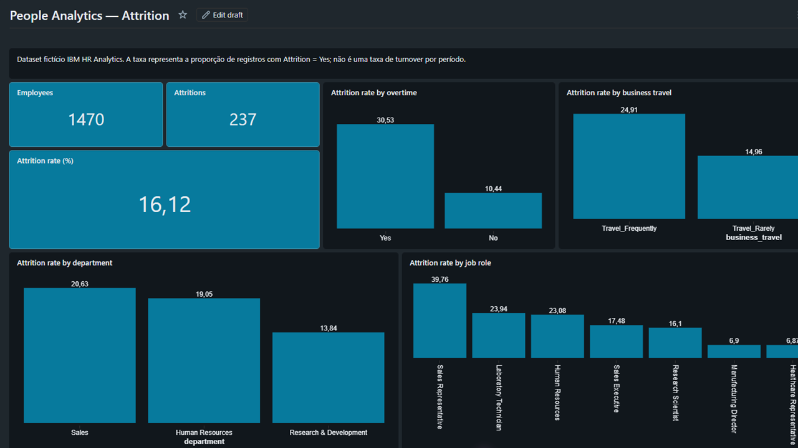

# People Analytics — Employee Attrition

## Overview

End-to-end People Analytics project developed in Databricks to transform employee data into attrition indicators and business insights.

The project demonstrates the complete data journey from raw HR data to analytical insights using the **Medallion Architecture**.

> **Dataset note:** The IBM HR Analytics dataset is a fictional/educational dataset. The attrition rate represents the proportion of records with `Attrition = Yes`; it is not a period-based turnover rate.

---

## Business Question

**Which employee characteristics are associated with higher observed attrition in the dataset?**

The analysis explores attrition across:

- Overtime
- Business Travel
- Department
- Job Role

---

## Architecture

```text
IBM HR Analytics
       │
       ▼
   ┌─────────┐
   │ BRONZE  │
   │ Raw data│
   └────┬────┘
        │
        ▼
   ┌─────────┐
   │ SILVER  │
   │ Quality │
   │ & Clean │
   └────┬────┘
        │
        ▼
   ┌─────────┐
   │  GOLD   │
   │ HR KPIs │
   └────┬────┘
        │
        ▼
   ┌─────────────┐
   │  Dashboard  │
   │  Attrition  │
   └─────────────┘

```
## Data

**Dataset:** IBM HR Analytics Employee Attrition & Performance

**Population analyzed:** 1,470 employees

**Observed attritions:** 237

**Observed attrition rate:** 16.12%


---

## Data Pipeline

### 1. Bronze — Data Ingestion

The Bronze layer preserves the source data with minimal transformation.

Main activities:

- Source data ingestion
- Schema inspection
- Record validation
- Delta table creation
- Ingestion timestamp for traceability

**Notebook:** `01_Bronze_Ingestion.py`

### 2. Silver — Data Quality & Transformation

The Silver layer prepares the data for analytical use.

Main activities:

- Column name standardization
- Identifier validation
- Duplicate removal
- Text standardization
- Creation of `attrition_flag`
- Creation of analytical labels
- Data quality validation

**Notebook:** `02_Silver_Data_Quality.py`

### 3. Gold — People Analytics

The Gold layer transforms the cleaned data into business-oriented HR indicators.

The following analytical tables were created:

| Gold Table | Purpose |
|---|---|
| `workforce_gold` | Overall workforce and attrition indicators |
| `attrition_by_department_gold` | Attrition by department |
| `attrition_by_travel_gold` | Attrition by business travel |
| `attrition_by_overtime_gold` | Attrition by overtime |
| `attrition_by_role_gold` | Attrition by job role |

**Notebook:** `03_Gold_People_Analytics.py`

---

## Dashboard

The final dashboard presents the main People Analytics indicators and the observed attrition patterns identified in the dataset.



### Main Indicators

| Indicator | Result |
|---|---:|
| Employees | 1,470 |
| Attritions | 237 |
| Observed Attrition Rate | 16.12% |

### Analytical Dimensions

The dashboard analyzes observed attrition across:

- **Overtime**
- **Business Travel**
- **Department**
- **Job Role**
---

## Key Analytical Observations

The dashboard identifies differences in observed attrition across employee groups.

### Overtime

Employees classified with overtime present a higher observed attrition proportion than employees without overtime in this dataset.

- Overtime: **30.53%**
- No overtime: **10.44%**

This represents an association observed in the dataset and should not be interpreted as evidence that overtime causes attrition.

### Business Travel

Observed attrition also differs according to travel frequency.

- Travel Frequently: **24.91%**
- Travel Rarely: **14.96%**
- Non-Travel: **8.00%**

### Department

Observed attrition differs across departments:

- Sales: **20.63%**
- Human Resources: **19.05%**
- Research & Development: **13.84%**

### Job Role

Observed attrition also varies across job roles.

Examples include:

- Sales Representative: **39.76%**
- Laboratory Technician: **23.94%**
- Human Resources: **23.08%**
- Sales Executive: **17.48%**
- Research Scientist: **16.10%**

These results describe patterns observed in this dataset. They do not establish causal relationships between employee characteristics and attrition.

---

## Technical Stack

- **Databricks**
- **Apache Spark**
- **PySpark**
- **SQL**
- **Delta Lake**
- **Medallion Architecture**
- **People Analytics**
- **Data Quality**

---

## Skills Demonstrated

### Data Engineering

- Data ingestion
- Data profiling
- Schema inspection
- Data quality validation
- Data transformation
- Deduplication
- Aggregation
- Delta table creation
- Medallion Architecture

### Databricks

- Databricks notebooks
- PySpark
- DataFrames
- Spark functions
- Delta Lake
- Table creation
- Table validation
- Analytical dashboards

### People Analytics

- Attrition analysis
- HR KPI definition
- Workforce segmentation
- Employee data analysis
- Business-oriented data interpretation
- Analytical storytelling
- Association versus causality

---

## Data Quality

The Silver layer includes several data quality controls:

- Validation of employee identifiers
- Duplicate detection and removal
- Standardization of column names
- Standardization of categorical fields
- Creation of analytical flags
- Validation of attrition categories
- Record count validation between layers

The final dataset contains **1,470 employee records**, including **237 records with `Attrition = Yes`**.

---

## Project Validation

The complete pipeline was validated after the Gold layer was created.

### Workforce validation

Employees: 1470
Attritions: 237
Attrition Rate: 16.12%

workforce_gold
attrition_by_department_gold
attrition_by_travel_gold
attrition_by_overtime_gold
attrition_by_role_gold


## Project Structure


people-analytics-attrition/
│
├── 01_Bronze_Ingestion.py
├── 02_Silver_Data_Quality.py
├── 03_Gold_People_Analytics.py
├── dashboard_attrition.png
└── README.md


## Medallion Architecture

The project follows a three-layer architecture:

### Bronze

Raw source data with minimal transformation and ingestion traceability.

### Silver

Validated, standardized and deduplicated employee data prepared for analysis.

### Gold

Business-oriented analytical tables containing People Analytics indicators.

```text
```
Bronze
  │
  │ Data ingestion
  ▼
Silver
  │
  │ Data quality & transformation
  ▼
Gold
  │
  │ Business indicators
  ▼
Dashboard


### Business Value

The project demonstrates how HR data can be transformed into structured analytical information to support People Analytics initiatives.

The resulting data model can support questions related to:

- Workforce composition
- Employee attrition
- Workforce segmentation
- HR indicators
- Organizational patterns
- Further statistical analysis
- Future predictive modeling

The analysis provides a foundation for moving from descriptive analytics toward more advanced People Analytics applications.

---

## Limitations

This project uses the IBM HR Analytics dataset, which is a fictional/educational dataset.

The analysis has important limitations:

- It does not represent a real organization's workforce.
- The dataset does not provide a longitudinal employee history suitable for calculating period-based turnover.
- The observed attrition rate represents the proportion of records where `Attrition = Yes`.
- Differences between groups should not be interpreted as causal effects.
- Further statistical and multivariate analysis would be required to investigate relationships between variables.

---

## Next Steps

Potential extensions of the project include:

- Attrition by age group
- Attrition by salary band
- Attrition by years at company
- Attrition by job level
- Employee satisfaction analysis
- Correlation analysis
- Multivariate analysis
- Statistical hypothesis testing
- Predictive attrition modeling
- Machine learning classification
- Model explainability
- Workforce risk segmentation


---

## Author

**Priscila Lima**

People Analytics | Workforce Planning | HR Data Analytics
